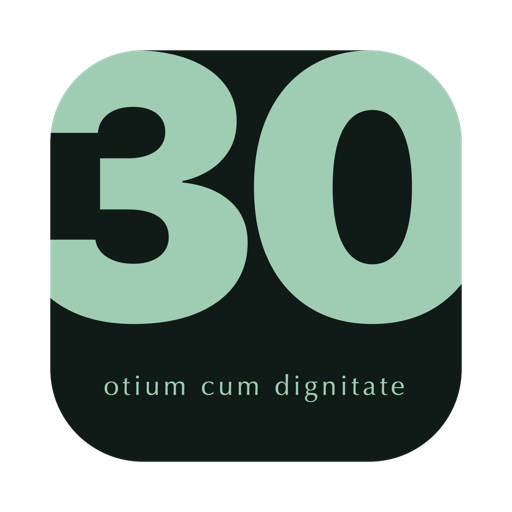
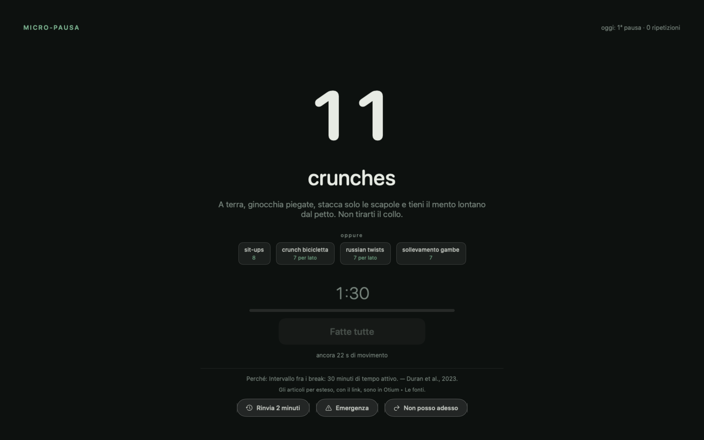
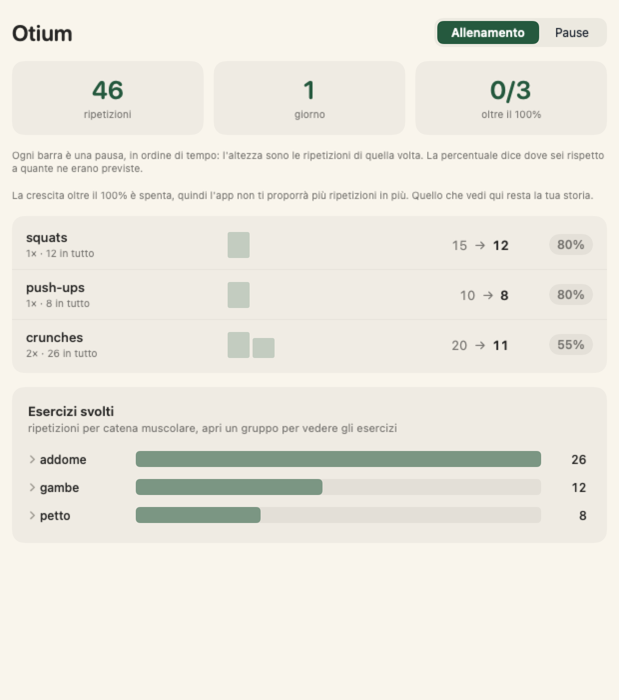
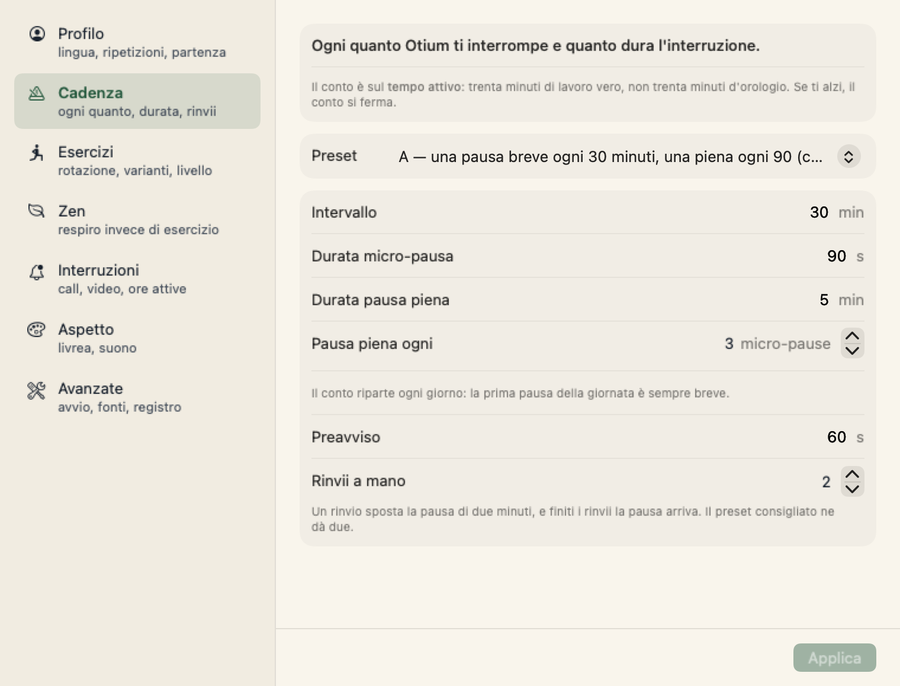
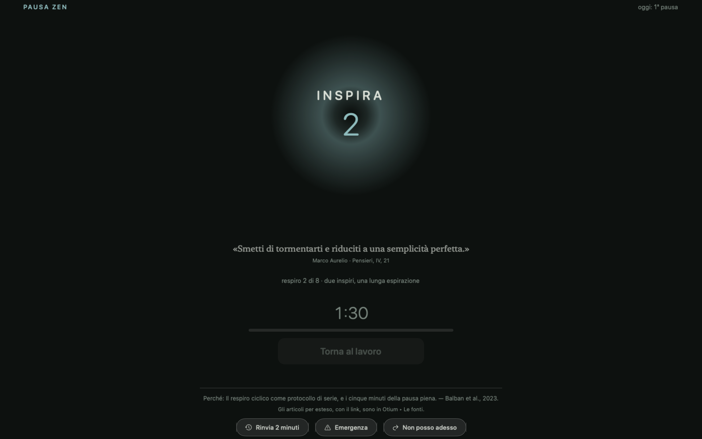

<div align="center">
  
  <h1>Otium</h1>
  <p><strong>Davanti a uno schermo il tempo smette di sentirsi. Questa app conta le ore che hai passato seduto davvero e ogni mezz'ora se ne riprende novanta secondi.</strong></p>
</div>

<p align="center">
  <a href="https://github.com/xmasyx/otium/releases/latest"></a>
  
  
  
  <a href="LICENSE"></a>
</p>

```bash
curl -fsSL https://raw.githubusercontent.com/xmasyx/otium/main/Scripts/install.sh | bash
```

L'installazione è tutta qui: scarica l'ultima release, mette l'app in `/Applications`, toglie la
quarantena e la avvia. [Leggi lo script](Scripts/install.sh) prima di darlo in pasto a una shell,
perché è corto e la riga che conviene guardare con i tuoi occhi è l'`xattr` che toglie la
quarantena. Chi preferisce compilare trova le istruzioni più sotto.

**Se preferisci scaricare a mano** invece di dare uno script in pasto a una shell, prendi l'archivio
da [Releases](../../releases). Otium è firmata con un certificato stabile mio ma **non notarizzata**:
la notarizzazione vuol dire iscriversi all'Apple Developer Program a 99 $ l'anno, e questo è un
progetto MIT gratuito.
macOS mette un flag di *quarantena* su tutto quello che arriva da internet, e su un'app che Apple non
ha notarizzato Gatekeeper non ti dà una scelta: rifiuta la prima apertura. Il flag si toglie a mano,
ed è la stessa cosa che fa l'installatore al posto tuo:

```sh
# metti Otium.app in /Applications, poi:
xattr -dr com.apple.quarantine /Applications/Otium.app
open /Applications/Otium.app
```

Niente telecamera. Niente abbonamento. Niente rete. Nessun permesso di sistema.

---

## Il problema

**Davanti a uno schermo il tempo smette di essere una cosa che senti.** Ti siedi per sistemare
una cosa sola. L'agente gira, tu leggi quello che esce, scrivi il prompt dopo. Sono passate quattro
ore, il lavoro è andato avanti e tu non ti sei mai alzato. Niente, sullo schermo, lo stava
misurando: il terminale non sa che stai leggendo da quaranta minuti, e il calendario continua a dire
che il pomeriggio era libero.

Poi la giornata finisce, e la ragione per cui non ci si allena è sempre la stessa. **Non ho tempo.**
Non è una bugia, è un problema di agenda. Un allenamento vuole un'ora libera da qualche parte, e ore
libere non ce ne sono.

**Otium infatti non te la chiede. Ti chiede due pause da novanta secondi ogni ora.** Tre minuti su
sessanta, presi da tempo che stavi perdendo comunque. Quello che ci guadagni è la testa nell'ora che
viene dopo, e il corpo negli anni. Sono misurati tutti e due, qui sotto.

| Cosa guadagni | Come è misurato |
|---|---|
| **attenzione e funzioni esecutive** | 30 meta-analisi, 383 studi, 18.347 persone: l'esercizio acuto migliora la cognizione (SMD 0,33), attenzione 0,37, funzioni esecutive 0,36, e **intensità, tipo e durata non moderano l'effetto** |
| **energia, vigore, umore** | 30 adulti sedentari: sei micro-sessioni da 5 minuti battono una camminata unica da 30 su umore, fatica e voglie di cibo |
| **glicemia** | cinque minuti ogni trenta tagliano del **58%** il picco dopo il pasto; le dosi minori spostano la pressione, non la glicemia |
| **mortalità** | 25.241 adulti che non fanno nessuno sport: tre episodi al giorno da uno o due minuti si associano a circa il **40% di mortalità in meno** in sette anni |
| **dolori e occhi** | cinque minuti di pausa in più ogni ora, **senza perdita di produttività misurata** |

Le fonti, con i link, stanno [più sotto](#perché-questi-numeri) e dentro l'app, sulla schermata che
ti sta bloccando.

<div align="center">
  
</div>

```
30 min di lavoro attivo  →  90 s   ·  8-15 squat o push-up
30 min                   →  90 s   ·  un esercizio diverso
30 min                   →  5 min  ·  una sessione vigorosa + 3 minuti lontano dallo schermo
```

---

## Come funziona

**Conta il tempo attivo, non quello dell'orologio.** Se ti fermi più di un minuto il contatore si
ferma; se torni prima riprende da dov'era. È il difetto più citato nelle recensioni delle
alternative, che sbloccano in base all'ora: basta allontanarsi un attimo per ritrovarsi la schermata
addosso.

**La pausa che ti prendi da solo vale.** Se ti alzi per più di 90 secondi la micro-pausa è fatta.
Oltre i 5 minuti vale come pausa piena.

**Ma stare fermo non è alzarsi**, ed è la parte che quasi tutte le app di pausa sbagliano. Leggere un
terminale è immobilità perfetta, cioè proprio quello che gli studi misurano quando parlano di
sedentarietà. Otium distingue i casi, e ogni segnale ha una scadenza: passato un certo tempo,
se non tocchi più niente, l'app smette di credergli.

| Cosa stai facendo | Conta come tempo seduto fino a |
|---|---|
| leggi un terminale o un editor | **5 minuti** |
| leggi un documento | **15 minuti** |
| guardi un video | **45 minuti** |
| sei in call | **non scade mai**, e la pausa non parte finché la call dura |
| te ne sei andato | non è tempo seduto: pausa naturale, nessun esercizio |

Da dove vengono queste scadenze, come riconosce un video e cosa succede a una pausa arretrata:
[come funziona, in dettaglio](docs/come-funziona.md).

**Il pulsante «fatto» non si accende subito.** Si sblocca solo dopo il tempo minimo plausibile per quelle
ripetizioni (ripetizioni × secondi per ripetizione). Senza telecamera è un sistema d'onore, ma
l'onore con un cronometro davanti costa più fatica della verità.

**Trenta esercizi in cinque famiglie** (gambe, spinta, addome, posturali, vigorosi), e la rotazione
non ti dà mai la stessa famiglia due volte di fila. Dentro una pausa di push-up puoi
passare con un clic a diamond, archer, dip su sedia, pike o inclinati: le ripetizioni si adeguano
alla difficoltà e il cronometro riparte dal cambio, così scegliere la variante più facile
all'ultimo secondo non serve a niente.

**La progressione va in tutte e due le direzioni.** Si parte dal 55% del volume e si arriva al 100%
in quattro settimane, perché partire pieni il primo giorno è il modo più rapido per farsi male e
disinstallare l'app. La crescita oltre il 100% segue la regola 2-for-2 dell'ACSM, e quando il numero
non sta più dentro la pausa l'app propone un movimento più duro invece di un numero più grande.

**Durante una call non ti blocca mai**, senza limite di rinvii né di durata. **E una via d'uscita c'è
sempre**: digitare per esteso una frase esatta. Ogni salto finisce nel registro, e non è un giudizio,
è un dato.

| Cosa hai fatto | Cosa hai deciso |
|---|---|
|  |  |
| Ogni barra è una pausa. La percentuale è quello che hai fatto contro quello che era prescritto, quindi un onesto 55% resta un 55%. | Ogni numero qui ha un valore di partenza che viene da uno studio, e cambiarne uno ti dice da quale preset sei appena uscito. |

### Quando non puoi fare squat: la modalità Zen

Un open space, una scrivania in coworking, la terza call della mattina. **La modalità Zen sostituisce
l'esercizio con un respiro guidato**, che si fa da seduti, senza cambiarsi e senza farsi notare. Si
accende dal menu della barra con un clic.

<div align="center">
  
</div>

| Protocollo | Da dove viene |
|---|---|
| **due inspiri, una lunga espirazione** *(di serie)* | [Balban et al. 2023](https://pubmed.ncbi.nlm.nih.gov/36630953/), *Cell Reports Medicine*. Randomizzato controllato su 108 persone: cinque minuti al giorno per 28 giorni hanno battuto la meditazione mindfulness su umore e frequenza respiratoria, e hanno battuto gli altri due protocolli provati |
| **cinque secondi dentro, cinque fuori** | [Laborde et al. 2022](https://pubmed.ncbi.nlm.nih.gov/35623448/). Revisione di 223 studi: attorno ai sei respiri al minuto cuore e respiro entrano in fase, ed è lì che la variabilità cardiaca a mediazione vagale sale di più |
| **respiro quadrato** | il più facile da ricordare, ed è per questo che è ovunque. Funziona, meno del sospiro |

**E qui c'è il limite, dichiarato invece che nascosto.** Il lavoro sul respiro abbassa lo stress con
un effetto piccolo-medio (g = −0,35 su 12 studi randomizzati e 785 adulti), e quasi tutti quegli
studi hanno rischio di bias moderato
([Fincham et al. 2023](https://pubmed.ncbi.nlm.nih.gov/36624160/), *Scientific Reports*). E agisce per
un'altra via: **respirare contrae il diaframma, non i grandi muscoli delle gambe, ed è la loro
contrazione a tirare il glucosio fuori dal sangue.** La modalità Zen serve per i giorni in cui
altrimenti salteresti la pausa del tutto, non è uno scambio alla pari.

### Che cos'è il blocco, e che cosa non è

Da macOS High Sierra nessuna finestra può stare sopra il lock screen di sistema, e qualunque
processo si può uccidere da un terminale. Otium non è un lucchetto, è **attrito forte**. Copre tutti
gli schermi al livello di schermatura del sistema, nasconde Dock e barra dei menu, disabilita ⌘-Tab, Exposé, uscita
forzata e chiusura di sessione. Chi vuole aggirarla ci riesce, e va bene così: il punto è mettere la
scelta davanti agli occhi, non toglierla.

---

## Perché questi numeri

Le app concorrenti si dichiarano *science-backed* senza citare una fonte. Questa mette la citazione
sulla schermata che ti sta bloccando.

| Parametro | Da dove viene |
|---|---|
| **Una pausa ogni 30 minuti** | [Duran et al. 2023](https://www.cuimc.columbia.edu/news/rx-prolonged-sitting-five-minute-stroll-every-half-hour). Crossover randomizzato su quattro dosi: solo «5 minuti ogni 30» ha appiattito i picchi glicemici (−58%). Le dosi minori abbassano la pressione ma non la glicemia. |
| **Esercizi di forza, non una camminata** | [Gao, Li, Finni & Pesola 2024](https://onlinelibrary.wiley.com/doi/abs/10.1111/sms.14628). 3 minuti di squat ogni 45' hanno battuto una camminata unica da 30', con circa il doppio del beneficio glicemico. Conta l'attivazione muscolare, non i passi. |
| **Novanta secondi bastano a contare** | [Chang, Ren, Li, Ai, Kao & Etnier 2025, *Psychological Bulletin*](https://pubmed.ncbi.nlm.nih.gov/39883421/). Meta-revisione di 30 meta-analisi (383 studi, 18.347 partecipanti): l'esercizio acuto migliora la cognizione, SMD 0,33 (IC 95% 0,24-0,42), attenzione 0,37, funzioni esecutive 0,36. E per una pausa da novanta secondi conta soprattutto questo: **intensità, tipo e durata non sono risultati moderatori significativi**. |
| **Distribuito batte concentrato** | [Bergouignan et al. 2016](https://pubmed.ncbi.nlm.nih.gov/27716360/), *IJBNPA*. 30 adulti sedentari, crossover randomizzato: sei micro-sessioni da 5 minuti, una ogni ora, hanno migliorato umore, fatica e voglie di cibo dove una camminata unica da 30 minuti al mattino non ci è riuscita. La prestazione cognitiva non è cambiata in nessuno dei due casi. |
| **Perché interrompere funziona** | [Ariga & Lleras 2011](https://pubmed.ncbi.nlm.nih.gov/21211793/), *Cognition*. Il calo dell'attenzione non è una batteria che si scarica, è l'obiettivo stesso che si abitua. Disattivarlo per un attimo lo previene. La loro pausa però era un cambio di compito mentale, non del movimento. |
| **La pausa piena da 5 minuti** | [Galinsky et al. 2000](https://pubmed.ncbi.nlm.nih.gov/10877480/) (più il follow-up del 2007). 5 minuti di pausa in più ogni ora riducono disturbi muscoloscheletrici e affaticamento visivo **senza perdita di produttività misurata**. |
| **90 secondi per il micro-snack** | [Albulescu et al. 2022](https://journals.plos.org/plosone/article?id=10.1371/journal.pone.0272460). Meta-analisi di 22 studi: le micro-pause sotto i 10 minuti riducono la fatica e alzano il vigore. Gli autori avvertono che dopo lavoro cognitivo pesante 10 minuti non bastano, ed è per questo che ogni 90 minuti la pausa è piena. |
| **La sessione vigorosa, e il bersaglio di 3 al giorno** | [Stamatakis et al. 2022, *Nature Medicine*](https://www.wcrf.org/about-us/news-and-blogs/vigorous-exercise-and-the-science-behind-exercise-snacking/). 25.241 adulti non sportivi: tre sessioni al giorno da 1-2 minuti di attività vigorosa si associano a circa il 40% di mortalità in meno a 7 anni. |

**E una funzione che Otium non implementa.** La regola 20-20-20 è in quasi tutte le app di pausa. In
un [trial del 2023](https://www.optometryadvisor.com/features/digital-eye-strain-may-not-be-solved-by-the-20-20-20-rule/)
che ha confrontato pause da 20 secondi ogni 5, 10 e 20 minuti non è uscita nessuna differenza su
sintomi, velocità e accuratezza di lettura. I tre «20» furono scelti perché sono facili da
ricordare, non perché fossero ottimizzati. La pausa motoria riposa gli occhi lo stesso.

---

## Privacy e permessi

Otium **non compare** in Impostazioni → Privacy e sicurezza, perché non usa niente che lo richieda.

- L'inattività si legge da `CGEventSource`, che non richiede né Accessibilità né Input Monitoring.
- Il rilevamento delle call legge `kAudioDevicePropertyDeviceIsRunningSomewhere` e il suo gemello
  video, cioè *se* un dispositivo è in uso, senza nessuno stream aperto e senza un byte di audio o
  di immagine.
- Il preavviso è un pannello dell'app, non una notifica di sistema, che richiederebbe un permesso.
- Niente registrazione dello schermo, niente rete.

Tutto resta in `~/Library/Application Support/Otium/`: `settings.json` e `ledger.jsonl`, un registro
append-only in JSON Lines che puoi leggere con qualsiasi cosa.

---

## Compilarla da sé

Servono macOS 15+ e Xcode (o i Command Line Tools):

```bash
git clone https://github.com/xmasyx/otium.git && cd otium
Scripts/build-app.sh          # produce dist/Otium.app, firmata ad-hoc
open dist/Otium.app
```

L'app vive nella barra dei menu: il numero dice quanti minuti di lavoro attivo mancano alla prossima
pausa. Da lì arrivi ai totali di oggi, alle preferenze, alle fonti e al registro. L'interfaccia è in
italiano e in inglese, si cambia in Preferenze. Ne gira una sola alla volta.

Per farla partire all'accensione c'è Preferenze → *Avvio automatico*, che passa da `SMAppService`:
Otium compare fra le app di *Impostazioni di Sistema → Generali → Elementi login*, con il suo
interruttore, e se lo spegni da lì l'app non se lo rimette.

I comandi da terminale, la demo della schermata di pausa e la migrazione dal vecchio LaunchAgent
stanno in [come funziona](docs/come-funziona.md).

## Cosa c'è già, e cosa no

| | Otium | [Stretchly](https://github.com/hovancik/stretchly) | Time Out | [Workrave](https://workrave.org) |
|---|---|---|---|---|
| macOS nativo | ✅ ~5 MB | Electron | ✅ | ❌ (port fermo) |
| conta il tempo **attivo** | ✅ | pausa su idle | ✅ *natural breaks* | ✅ |
| sa che il terminale è lavoro | ✅ | ❌ | ❌ | ❌ |
| blocca davvero lo schermo | ✅ | parziale | ❌ | ✅ |
| esercizi con ripetizioni | ✅ | idee testuali | ❌ | ✅ guidati |
| una modalità per quando non puoi muoverti | ✅ respiro guidato | ❌ | ❌ | ❌ |
| mostra le fonti | ✅ | ❌ | ❌ | ❌ |
| prezzo | gratis, a sorgente aperto | gratis | gratis | gratis |

## Qualcosa non va?

**Preferenze → Avanzate → «Apri la diagnostica…»** fa 12 controlli sull'installazione e stampa il
referto; da terminale la stessa cosa è `Otium --doctor`. Il pulsante «Segnala un problema…» qui
accanto apre su GitHub una segnalazione già compilata con la versione, la build di macOS e quel
referto.

L'app non manda niente da sola: costruisce un indirizzo e apre il browser, quindi il testo lo leggi
tu e decidi tu cosa parte. Il referto non porta nemmeno la tua cartella home, perché i percorsi
diventano `~` prima di uscire dall'app.

## In programma

- Verifica reale delle ripetizioni **senza telecamera**: movimento della testa dagli AirPods
  (`CMHeadphoneMotionManager`) o Apple Watch.
- Notarizzazione, così lo scaricato si apre senza togliere la quarantena a mano.
- Report settimanale: ripetizioni, pause rispettate, tempo davanti al Mac.

## Test

```bash
swift test                           # 440 test: orologio, motore, rampa, rotazione, registro, lingua
swift Scripts/probe-blocker.swift    # verifica che il blocco copra ogni schermo (con l'app in blocco)
```

## Licenza

**PolyForm Noncommercial 1.0.0**, testo completo in [`LICENSE`](LICENSE).

Il codice è **a sorgente aperto ma non open source**, e la differenza è dichiarata qui invece di
essere lasciata capire. Puoi leggerlo, compilarlo, modificarlo e usarlo liberamente per te, per
studio e per ricerca. Lo stesso vale per scuole, enti pubblici e non profit. Serve invece il mio
permesso per usarlo a fini commerciali. Non lo chiamo open source perché secondo la definizione
dell'OSI non lo è. Otium può diventare un prodotto, e questa licenza tiene aperta quella porta senza
chiudere l'unica cosa che conta per chi lo installa: il codice resta leggibile, quindi «nessuna rete,
nessun permesso di sistema» si può verificare invece che credere.

Nessuna dipendenza di terze parti: solo Swift e i framework di sistema di macOS.

Le 338 citazioni e le 73 frasi mostrate durante la pausa vengono da autori di pubblico dominio
(Seneca, Marco Aurelio, Epitteto, Nietzsche, Montaigne, Pascal, Spinoza, Leopardi, Sunzi, Tao Te
Ching, Dialoghi, Dhammapada, Gita), in traduzioni storiche anch'esse di pubblico dominio per 313
delle 338. Le restanti 25 sono di questo progetto, sotto la stessa licenza del codice.

---

*[Read this README in English](README.md).*
