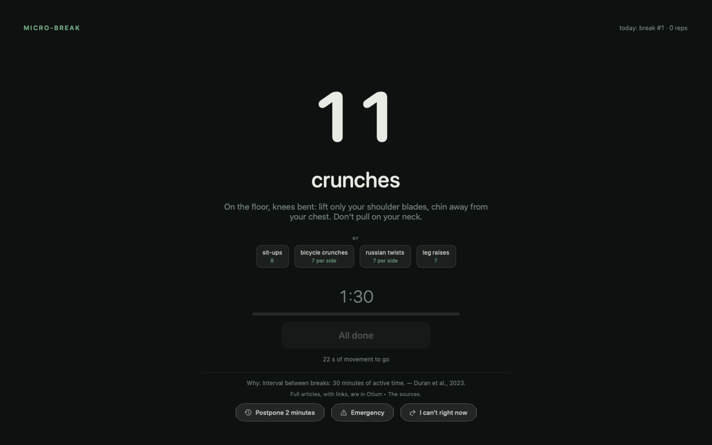
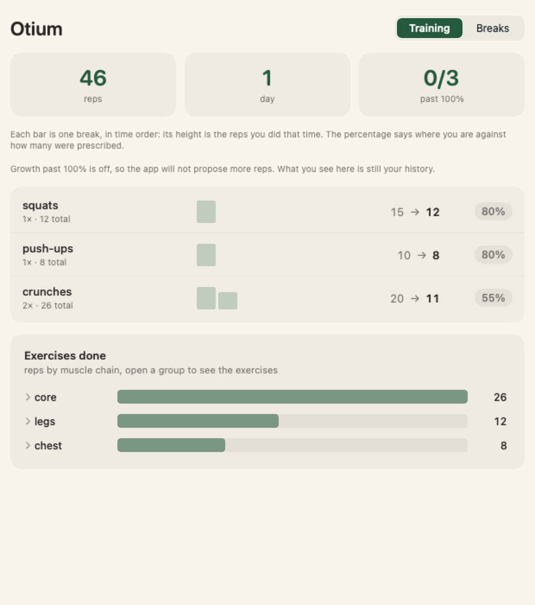
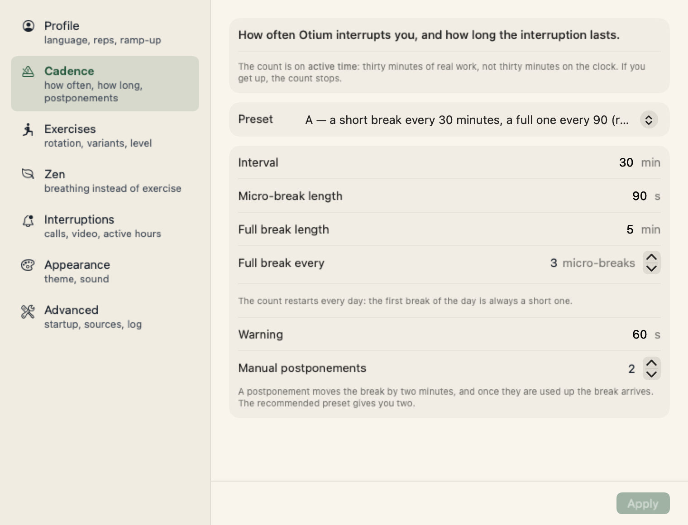
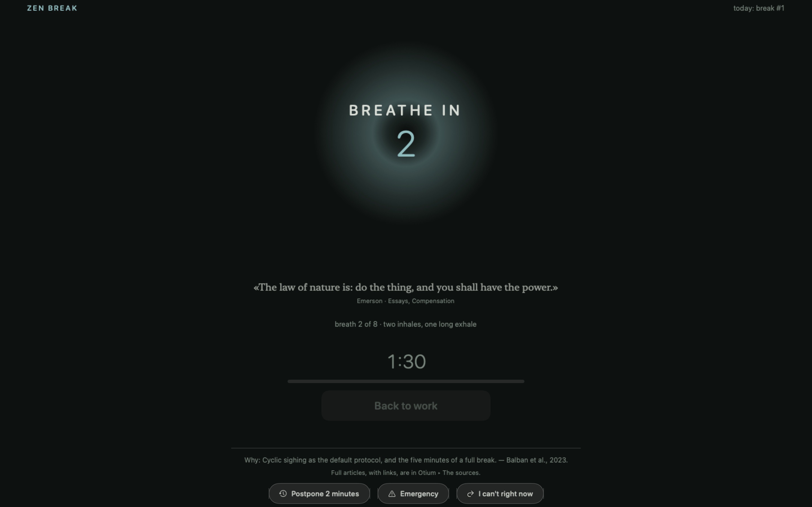

<div align="center">
  
  <h1>Otium</h1>
  <p><strong>At a computer you stop feeling time pass. This counts the hours you actually spent sitting, and every half hour it takes 90 seconds back.</strong></p>
</div>

<p align="center">
  <a href="https://github.com/xmasyx/otium/releases/latest"></a>
  
  
  
  <a href="LICENSE"></a>
</p>

```bash
curl -fsSL https://raw.githubusercontent.com/xmasyx/otium/main/Scripts/install.sh | bash
```

That is the whole install: it downloads the latest release, puts the app in `/Applications`, clears
the quarantine flag and launches it. [Read the script](Scripts/install.sh) before piping it to a
shell — it is short, and the one line worth confirming yourself is the `xattr` that clears
quarantine. Building from source is [further down](#build-it-yourself).

**What it needs:** macOS 15 or newer, on either processor. The release is a universal binary, so
`lipo -archs Otium.app/Contents/MacOS/Otium` answers `x86_64 arm64`, and the installer asks the
downloaded app to run on your Mac before it copies anything into `/Applications`.

**If you prefer to download by hand** rather than pipe a script into a shell, grab the archive from
[Releases](../../releases). Otium is **signed ad-hoc and not notarized**: an ad-hoc signature
carries no certificate and no Team ID, and its identity changes with every build. Check it on the
file you downloaded — `codesign -dvv Otium.app` answers `Signature=adhoc` and
`TeamIdentifier=not set`. Notarization means enrolling in the Apple Developer Program at $99 a
year, and this is a free project under a [noncommercial licence](LICENSE). macOS puts a
*quarantine* flag on anything downloaded from the internet, and on an app Apple has not notarized
Gatekeeper does not offer you a choice: it refuses the first launch. Clear the flag yourself, which
is the same thing the installer does for you:

```sh
# put Otium.app in /Applications, then:
xattr -dr com.apple.quarantine /Applications/Otium.app
open /Applications/Otium.app
```

No camera. No subscription. No network. No system permissions.

---

## The problem

**In front of a screen, time stops being something you feel.** You sit down to fix one thing. The
agent runs, you read what comes out, you type the next prompt. Four hours are gone, the work moved
forward, and you have not stood up once. Nothing on your screen was measuring that: the terminal
does not know you have been reading its output for forty minutes, and your calendar still shows a
free afternoon.

And when the day ends, the reason people give for not training is always the same one: **no time.**
It is not a lie. It is a scheduling problem — a workout is a block you have to find, and there is no
block left.

**So Otium does not ask for a block. It asks for ninety seconds, twice an hour.** Three minutes out
of sixty, taken from time you were losing anyway. What you get back is your head in the hour that
follows, and your body over the years — both measured, both below.

| What you get back | Measured how |
|---|---|
| **attention and executive function** | 30 meta-analyses, 383 studies, 18,347 people: acute exercise improves cognition (SMD 0.33), attention 0.37, executive function 0.36 — and **intensity, type and duration did not moderate the effect** |
| **energy, vigour, mood** | 30 sedentary adults: six 5-minute walking micro-bouts beat a single 30-minute walk on mood, fatigue and food cravings |
| **glucose** | five minutes every thirty cut the post-meal spike by **58%**; smaller doses moved blood pressure but not glucose |
| **mortality** | 25,241 adults who do no exercise at all: three daily bouts of one to two minutes were associated with ~**40% lower mortality** over seven years |
| **aches and eye strain** | five extra minutes of break per hour, with **no measured loss of productivity** |

Sources, with links, are [further down](#where-the-numbers-come-from) — and inside the app, on the
screen that is blocking you.

<div align="center">
  
</div>

```
30 min of active work  →  90 s   ·  8-15 squats or push-ups
30 min                 →  90 s   ·  a different exercise
30 min                 →  5 min  ·  a vigorous bout + 3 minutes away from the screen
```

---

## How it works

**It counts active time, never the wall clock.** Stop for more than a minute and the counter stops;
come back sooner and it resumes where it was. This is the most cited complaint in reviews of the
alternatives: they unlock on clock time, so a moment away is enough to find the screen in your face.

**A break you take yourself counts.** Get up on your own for more than 90 seconds and the
micro-break is done. Over 5 minutes counts as a full break.

**But sitting still is not getting up**, and this is the part most break apps get wrong. Reading a
terminal is perfect stillness — which is exactly the sedentary bout the studies measure. Otium tells
these cases apart, and each signal has a cap beyond which it is no longer believed with no input at
all:

| What you are doing | Counts as sitting for up to |
|---|---|
| reading a terminal or an editor | **5 minutes** |
| reading a document | **15 minutes** |
| watching a video | **45 minutes** |
| on a call | **no cap** — and the break does not fire while the call lasts |
| you left | not sitting: a natural break, no exercise |

Why each cap is what it is, how video is detected, and what happens to an overdue break:
[how it works, in detail](docs/how-it-works.md).

**The "done" button has a gate.** It unlocks only after the minimum plausible time for those reps
(reps × seconds per rep). Without a camera this is an honour system, but honour with a stopwatch in
front of it costs more effort than the truth.

**Thirty exercises in five families** — legs, push, core, posture, vigorous — and the rotation never
gives you the same family twice in a row. Inside a push-up break you can switch in one click to
diamond, archer, bench dips, pike or incline: the reps adjust to the difficulty, and the stopwatch
restarts on the switch, so picking the easiest variant at the last second gets you nothing.

**Progression, in both directions.** Reps start at 55% of the volume and reach 100% over four weeks,
because starting full on day one is the fastest way to hurt yourself and uninstall the app. Growth
beyond 100% follows the ACSM's 2-for-2 rule, and once the number no longer fits in the break the app
offers a harder movement instead of a bigger number.

**It never blocks you during a call**, with no limit on postponements or duration. **And it does not
lock you out**: there is always a way out, typing an exact phrase in full. Every skip goes in the
log, which is a data point and not a judgement.

| What you did | What you decided |
|---|---|
|  |  |
| Every bar is one break. The percentage is what you did against what was prescribed, so an honest 55% shows up as 55%. | Every number here has a default that comes from a study, and changing one tells you which preset you just left. |

### When you can't do squats: Zen mode

An open-plan office, a coworking desk, the third call of the morning. **Zen mode replaces the
exercise with guided breathing**, done sitting, without changing clothes, without anybody noticing.
One click from the menu bar.

<div align="center">
  
</div>

| Protocol | Where it comes from |
|---|---|
| **two inhales, one long exhale** *(default)* | [Balban et al. 2023](https://pubmed.ncbi.nlm.nih.gov/36630953/), *Cell Reports Medicine* — an RCT in 108 people: five minutes a day for 28 days beat mindfulness meditation on mood and respiratory rate, and beat the other two protocols tested |
| **five seconds in, five out** | [Laborde et al. 2022](https://pubmed.ncbi.nlm.nih.gov/35623448/) — a review of 223 studies: around six breaths a minute, heart and breath fall into phase and vagally-mediated HRV rises the most |
| **box breathing** | the easiest to remember, which is why it is everywhere. It works, less well than the sigh |

**And here is the ceiling, stated rather than buried.** Breathwork lowers stress with a small-to-
medium effect (g = −0.35 across 12 randomised trials and 785 adults), and nearly all those trials
carry a moderate risk of bias
([Fincham et al. 2023](https://pubmed.ncbi.nlm.nih.gov/36624160/), *Scientific Reports*). It also
travels a different road: **breathing contracts the diaphragm, not the large leg muscles, and it is
their contraction that pulls glucose out of the blood.** Zen mode is for the days you would
otherwise skip the break entirely, not an equal swap.

### What the block is, and what it is not

Since macOS High Sierra no window can sit above the system lock screen, and any process can be
killed from a terminal. Otium is not a padlock, it is **strong friction**: it covers every screen at
shielding level, hides the Dock and menu bar, disables ⌘-Tab, Exposé, Force Quit and log-out.
Anyone who wants to get around it will, and that is fine. The point is to put the choice in front of
your eyes, not to take it away.

---

## Where the numbers come from

Competing apps call themselves *science-backed* without citing a single source. This one puts the
citation on the screen that is blocking you.

| Parameter | Where it comes from |
|---|---|
| **A break every 30 minutes** | [Duran et al. 2023](https://www.cuimc.columbia.edu/news/rx-prolonged-sitting-five-minute-stroll-every-half-hour) — a randomised crossover of four doses: only "5 minutes every 30" flattened the glucose spikes (−58%). Smaller doses lower blood pressure but not glucose. |
| **Strength work, not a walk** | [Gao, Li, Finni & Pesola 2024](https://onlinelibrary.wiley.com/doi/abs/10.1111/sms.14628) — 3 minutes of squats every 45' beat a single 30' walk, with roughly twice the glycaemic benefit. What counts is muscle activation, not steps. |
| **90 seconds is enough to matter** | [Chang, Ren, Li, Ai, Kao & Etnier 2025, *Psychological Bulletin*](https://pubmed.ncbi.nlm.nih.gov/39883421/) — a meta-review of 30 meta-analyses (383 studies, 18,347 participants): acute exercise improves cognition, SMD 0.33 (95% CI 0.24–0.42), attention 0.37, executive function 0.36. Crucially for a 90-second break, **exercise intensity, type and duration were not significant moderators**. |
| **Spread out beats one block** | [Bergouignan et al. 2016](https://pubmed.ncbi.nlm.nih.gov/27716360/), *IJBNPA* — 30 sedentary adults, randomised crossover: six hourly 5-minute micro-bouts improved mood, fatigue and food cravings where a single 30-minute morning walk did not. Cognitive performance was unchanged in both. |
| **Why interrupting works at all** | [Ariga & Lleras 2011](https://pubmed.ncbi.nlm.nih.gov/21211793/), *Cognition* — the attention decline is not a drained tank, it is the goal itself habituating. Briefly deactivating it prevents the decline. Their break was a mental switch, not movement. |
| **The 5-minute full break** | [Galinsky et al. 2000](https://pubmed.ncbi.nlm.nih.gov/10877480/) (plus the 2007 follow-up) — 5 extra minutes of break per hour reduce musculoskeletal discomfort and eye strain **with no measured loss of productivity**. |
| **90 seconds for the micro-snack** | [Albulescu et al. 2022](https://journals.plos.org/plosone/article?id=10.1371/journal.pone.0272460) — a meta-analysis of 22 studies: micro-breaks of ≤10 min reduce fatigue and raise vigour. The authors warn that after heavy cognitive work 10 minutes are not enough, which is why every 90 minutes the break is a full one. |
| **The vigorous bout, and the target of 3 a day** | [Stamatakis et al. 2022, *Nature Medicine*](https://www.wcrf.org/about-us/news-and-blogs/vigorous-exercise-and-the-science-behind-exercise-snacking/) — 25,241 non-exercising adults: three daily bouts of 1-2 minutes of vigorous activity are associated with ~40% lower mortality over 7 years. |

**And one feature Otium does NOT implement.** The 20-20-20 rule is in nearly every break app. In a
[2023 trial](https://www.optometryadvisor.com/features/digital-eye-strain-may-not-be-solved-by-the-20-20-20-rule/)
comparing 20-second breaks at 5, 10 and 20 minute intervals, no difference emerged in symptoms,
reading speed or accuracy. The three "20"s were chosen because they are memorable, not because they
were optimised. The movement break rests your eyes anyway.

---

## Privacy and permissions

Otium **does not appear** in Settings → Privacy & Security, because it uses nothing that would
require it:

- idle time is read from `CGEventSource`, which needs neither Accessibility nor Input Monitoring;
- call detection reads `kAudioDevicePropertyDeviceIsRunningSomewhere` and its video twin, that is
  *whether* a device is in use — no stream opened, not one byte of audio or image;
- the warning is a panel drawn by the app, not a system notification (which would need a permission);
- no screen recording, no network.

Everything stays in `~/Library/Application Support/Otium/`: `settings.json` and `ledger.jsonl`, an
append-only JSON Lines log you can read with anything.

---

## Build it yourself

macOS 15+ and Xcode (or the Command Line Tools):

```bash
git clone https://github.com/xmasyx/otium.git && cd otium
Scripts/build-app.sh          # dist/Otium.app: universal (arm64 + x86_64), ad-hoc signed
open dist/Otium.app
```

The app lives in the menu bar: the number is how many minutes of active work remain until the next
break. From there: today's totals, preferences, the sources, the log. The interface is in English
and Italian, switchable in Preferences. Only one instance runs at a time.

To start it at login, use Preferences → *Start at login*. It goes through `SMAppService`, so Otium
shows up under *System Settings → General → Login Items* with its own switch — and if you turn it
off there, the app does not put it back.

Command-line flags, the demo of the break screen, and the migration off the old LaunchAgent are all
in [how it works](docs/how-it-works.md).

## What already exists, and what doesn't

| | Otium | [Stretchly](https://github.com/hovancik/stretchly) | Time Out | [Workrave](https://workrave.org) |
|---|---|---|---|---|
| native macOS | ✅ ~5 MB | Electron | ✅ | ❌ (port stalled) |
| counts **active** time | ✅ | pauses on idle | ✅ *natural breaks* | ✅ |
| knows the terminal is work | ✅ | ❌ | ❌ | ❌ |
| really blocks the screen | ✅ | partial | ❌ | ✅ |
| exercises with reps | ✅ | text ideas | ❌ | ✅ guided |
| a mode for when you can't move | ✅ guided breathing | ❌ | ❌ | ❌ |
| shows its sources | ✅ | ❌ | ❌ | ❌ |
| price | free, source-available | free | free | free |

## Something wrong?

**Preferences → Advanced → "Open diagnostics…"** runs 12 checks on the install and prints the
report; the same thing from a terminal is `Otium --doctor`. **"Report a problem…"** next to it opens
a GitHub issue already filled in with the version, the macOS build and that report.

The app sends nothing by itself: it builds a URL and opens your browser, so you read the text and
decide what goes out. The diagnostics never carry your home folder either — paths are shortened to
`~` before they leave the app.

## Planned

- Real rep verification **without a camera**: head motion from AirPods
  (`CMHeadphoneMotionManager`) or Apple Watch.
- Notarisation, so the download opens without clearing quarantine by hand.
- A weekly report: reps, breaks kept, time at the Mac.

## Tests

```bash
swift test                           # 440 tests: clock, engine, ramp, rotation, ledger, wording
swift Scripts/probe-blocker.swift    # checks the block covers every screen (with the app blocking)
```

## Licence

**PolyForm Noncommercial 1.0.0**, full text in [`LICENSE`](LICENSE).

The code is **source-available, not open source**, and the difference is stated here rather than
left to be inferred: you may read it, build it, modify it and use it freely for yourself, for study
and for research, and the same goes for schools, public bodies and non-profits. Using it
commercially needs my permission. I don't call it open source because by the OSI definition it
isn't. Otium could become a product, and this licence keeps that door open without closing the only
thing that matters to whoever installs it: the code stays readable, so "no network, no system
permissions" can be verified instead of believed.

No third-party dependencies: only Swift and the macOS system frameworks.

The 338 quotations and 73 lines shown during a break come from public-domain authors (Seneca, Marcus
Aurelius, Epictetus, Nietzsche, Montaigne, Pascal, Spinoza, Leopardi, Sun Tzu, Tao Te Ching, the
Analects, the Dhammapada, the Gita), in historical public-domain translations for 313 of the 338.
The remaining 25 are this project's own, under the same licence as the code.

---

*[Leggi questo README in italiano](README-it.md).*
